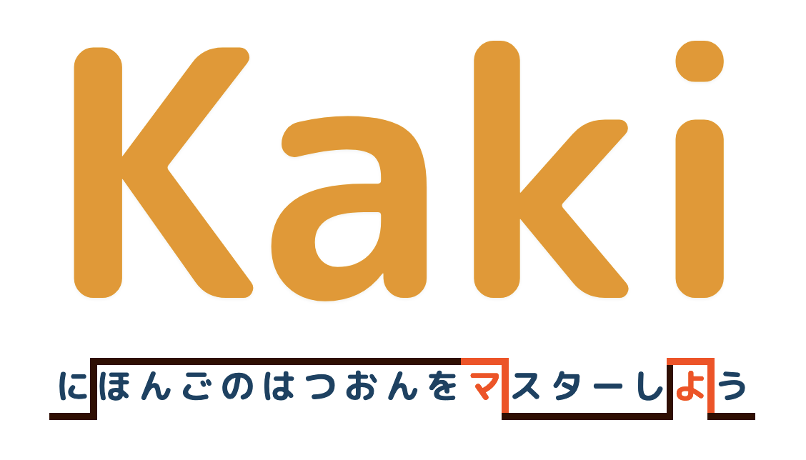

<h1 align="center">Kaki</h1>

<h2 align="center">A pitch-accent-focused study tool for Japanese</h2>

  <a>
    

[Kaki](https://kaki-study.vercel.app/) is a minimalistic web app for studying Japanese pitch accent for vocabulary via spaced repetition. It is aimed at people who have been studying Japanese vocabulary but haven't necessarily been focusing on learning pitch. Version 1 includes only text-based visualizations of pitch, but future versions will include audio study modes as well as definition and reading study!

<h3 align="center"><a href="https://kaki-study.vercel.app/">Try Kaki!</h3>

## Important note

This website is under active development, and things may not work as intended. It probably cannot handle a large number of users just yet. Feel free to make an account, though, with that in mind and, also, to reach out to me at [mathew@mathewkramer.io](mailto:mathew@mathewkramer.io) if you have feedback or encounter an issue! If you'd prefer to make an account through Google OAuth, please let me know so that I can add you to the list of approved test users (and reopen the OAuth sign-in).

## About pitch accent

Japanese features a 'pitch accent' system, which means that a given mora (e.g. あ, か, さ, た...) may be pronounced with either a high tone or a low tone. These tones sometimes matter for word meaning: The name of this app, 'Kaki', means 'persimmon' when pronounced low-high, but 'oyster' when pronounced high-low!

Pitch accent also impacts general flow and ease of understanding. Imagine if you met someone who pronounced every English word with a different stress from what you're used to (*'ImaGINE if someONE PROnounced eveRY EnGLISH word with a diFERent stress...'*)—it would probably sound kind of odd, and it would be harder for you to follow what they're saying!

The same applies to Japanese pitch accent. While not as crucial to word meaning as tone is in a language like (for example) Mandarin Chinese, it is a fundamental part of the language that cannot be ignored—proficiency in spoken Japanese includes proficiency in the pitch accent system.

## About me

I'm a former academic linguist whose research focused on language contact ('What happens when multiple languages are being spoken in the same place or by the same person?') and language processing ('How is language represented and used in the brain?'). My particular focus was on Japanese-English bilinguals (among other folks).

My work was mainly in the area of syntax and typology, but I'm a long-time lover of phonetics and prosody, and a big pet peeve of mine as an L2 Japanese speaker and occasional language tutor has always been the lack of awareness surrounding pitch accent. If it is mentioned at all, it is often no more than a footnote. Whatever you have been told, though, pitch accent *does* matter, and it *isn't* hard to learn—you just need build your awareness of it!

My hope is to turn this app into a tool that can help people meet their pronunciation goals, whatever those may be.

## Updates

### Releases

- 1.0.0: Initial release (22/12/06)

### Roadmap

- Definition clean-up (*highest priority*)
- Progress page (*highest priority*)
- Info page explaining pitch accent
- Additional study modes
  - Pitch patterns with particles attached
  - Definitions
  - Kanji readings
- Phrase shadowing and phrasal pitch (*stretch goal?*)
- Custom study lists
- Intentional study progression order

## Conributing

Feel free to submit a pull request if you notice any bugs. (There are probably many!)

Another thing I could really use help with is the database. If you have free time on your hands and feel comfortable enough with Japanese to vet definitions and word difficulties, you can reach out to me at [mathew@mathewkramer.io](mailto:mathew@mathewkramer.io) and chat about potentially assisting with database cleanup.
